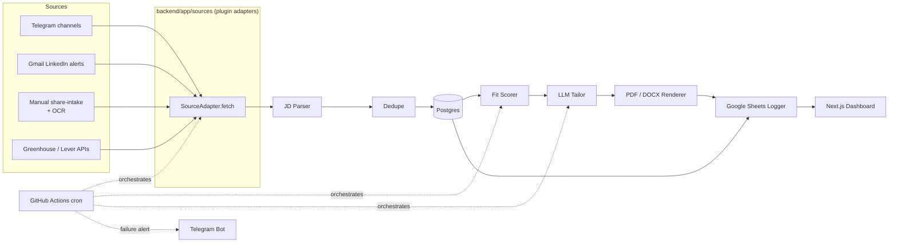

# SKYNET — Product Requirements

## Problem
Tarun (MSCS @ USC, F-1, targeting US AI/ML, SWE, systems, and networking
internships/new-grad roles) needs to track job posts across many fragmented,
fast-moving channels — Telegram groups, LinkedIn alert emails, creator
Instagram accounts, and individual company boards — parse each posting,
judge fit against his own background, and produce a tailored, ATS-safe
resume fast enough to apply while the posting is fresh. Doing this by hand
across a dozen sources every day doesn't scale.

## Users
Single user: Tarun. No multi-tenant requirements.

## Features
- Multi-source job ingestion via a plugin adapter interface (Telegram
  channels, Gmail-parsed LinkedIn alerts, manual Instagram/creator
  share-intake, Greenhouse/Lever public APIs).
- JD parsing into structured fields (title, company, location, seniority,
  must-have/nice-to-have skills, keywords).
- Fit scoring against a single master resume profile, with rationale.
- ATS-safe resume tailoring (selection/reordering/rewording only, no
  fabrication) rendered to 1-page PDF and DOCX.
- Google Sheets logging of every scored/tailored job.
- Daily dashboard summary ("Good morning, Tarun. SKYNET has N resumes ready.").
- 24/7 scheduled operation via serverless scheduled jobs (no VM) with
  failure alerts.

## Non-goals
- No scraping or automated login against LinkedIn or Instagram, ever.
- No auto-apply / auto-submission on Tarun's behalf.
- No multi-user support, no team features.
- No fabrication of resume content — the system only selects from real,
  pre-written profile data.

## Architecture

## Data model
- **Source** — id, type (telegram/gmail/share_intake/greenhouse/lever), name, config JSON.
- **JobPosting** — id, source_id, external_id, dedupe_hash, company, title,
  location, url, raw_text, parsed_jd (JSON: seniority, must_have, nice_to_have,
  keywords), posted_at, ingested_at.
- **ResumeItem** — not a DB table; one `data/resume_<domain>.md` file per job
  domain (id, section, title, tags[], dates, bullets[], keywords[] per item)
  is the source of truth for that domain, parsed at runtime by
  `backend/app/resume/loader.py`. `Job.domain` (set by the JD parser)
  selects which file tailoring uses; no file for that domain -> flagged,
  not tailored.
- **FitScore** — job_id, score, rationale, matched_resume_item_ids[].
- **TailoredResume** — id, job_id, pdf_path, docx_path, generated_at.
- **SheetSyncLog** — job_id, sheet_row_ref, synced_at.

## Pipeline
ingest (adapter) → parse (structured JD) → dedupe (hash on source+external_id
or normalized title+company+location) → persist (Postgres) → score (fit vs.
resume items) → tailor (LLM selects/reorders/rewords existing bullets) →
render (ATS-safe PDF+DOCX) → log (Google Sheets) → notify (dashboard +
Telegram alert on failure).

## Sources
- **Telegram** — Telethon client following configured job channels (list in
  config), read-only, no messages sent to groups.
- **LinkedIn** — never scraped/logged into. Gmail API (read-only scope)
  reads label/filtered LinkedIn job-alert emails; content is parsed like any
  other JD.
- **Instagram** (e.g. zero2sudo) and other creator channels — never scraped.
  Manual share-intake: Tarun forwards a post link, caption text, or
  screenshot to the SKYNET Telegram bot or dashboard upload; screenshots go
  through Tesseract OCR; result is processed like any other job. The same
  share-intake path accepts any Telegram/newsletter/website a creator runs.
- **Company boards** — Greenhouse/Lever public JSON APIs, company list in
  config.
- All sources implement the same plugin interface (`source-adapters` skill)
  so new sources are additive, not invasive.

## Marks

### Mark I — Foundation (this Mark)
Docs, permissions, repo skeleton, resume template. No ingestion/scoring/
tailoring logic yet.
**Acceptance:** docs present; `pytest` passes on the FastAPI
health-check stub; `docker compose config` validates; `npm run dev` serves
the placeholder dashboard page; resume template committed with example data.

### Mark II — Sources, parsing, DB
Implement Telegram, Gmail-LinkedIn, share-intake, Greenhouse/Lever adapters
against `SourceAdapter`; JD parsing; Alembic migrations for `Source`/
`JobPosting`; dedupe across sources.
**Acceptance:** each adapter has a passing unit test with fixture data; a
sample job from each source ends up as one deduped `JobPosting` row; running
the same fixture twice does not create a duplicate.

### Mark III — Score, tailor, render, log
Fit scoring against `ResumeItem`s; LLM-based tailoring (provider-agnostic,
default Gemini); ATS-safe PDF+DOCX rendering; Google Sheets logging.
**Acceptance:** given a fixture job + resume, scorer returns a score and
matched item ids; tailor output contains only strings present in the resume
profile (no-fabrication check passes); rendered PDF/DOCX pass a text-extraction
check (no images/tables, all resume keywords present as plain text); a sheet
row is created/updated for the job.

### Mark IV — Scheduler, deploy, alerts (done, fully live-verified)
Originally planned as a persistent VM daemon; switched to a fully
serverless design after Oracle Cloud (signup rejected), Google Cloud (card
hold), and Azure for Students (subscription region/quota policy) each hit
real friction. GitHub Actions scheduled workflows (hourly
ingest→parse→score→tailor→render→log, once-daily summary) replace the
always-on process; Neon (hosted Postgres) replaces a self-managed DB; a
Cloudflare Worker webhook replaces the long-polling share_bot listener;
generated resumes upload to Google Drive (via OAuth as Tarun — a service
account can't own files on a personal, non-Workspace Google account) since
Actions runners have no persistent disk. Telegram bot sends an alert on
any pipeline stage failure.
**Acceptance — all confirmed on live runs, not just fixtures:** a real
`schedule`-triggered GitHub Actions run completed the full pipeline
unattended; `test-alerts` produced real Telegram messages; a real
forwarded Telegram message went webhook → Neon → adapter → parsed Job; a
real Drive link landed in the Sheet; the daily summary workflow sent a
real digest. Greenhouse/Lever fetch every seed slug concurrently with a
hard per-request wall-clock cap, fixing sequential fetches alone eating
most of the step's time budget on a healthy run (~190s -> ~1-2s).
Greenhouse still hangs intermittently on GitHub's runner in a way three
different internal timeout mechanisms haven't caught live — contained
(1-minute step cap, never blocks the other 4 sources) but not
root-caused; see `DEPLOYMENT_TROUBLESHOOTING.md`.

### Mark V — Dashboard
Next.js PWA showing a daily digest ("Good morning, Tarun. SKYNET has N
resumes ready."), per-job score/rationale, and resume download links.
**Acceptance:** dashboard reflects the latest scheduler run without manual
refresh triggers; loads on mobile viewport; installable as a PWA.

### Mark VI — Auth
Passkey (WebAuthn) login with password fallback; PWA installability; push
notifications when new tailored resumes are ready.
**Acceptance:** passkey login works on at least one mobile + one desktop
browser; password fallback works when passkey is unavailable; a push
notification arrives within one scheduler cycle of a new resume being ready.

## Risks
- **LLM rate limits/cost** — free-tier Gemini quota may throttle under load;
  mitigate with a rate-limit queue, backoff, and response caching across
  the provider interface.
- **Gmail API quota & OAuth verification** — read-only scope still requires
  a Google OAuth consent flow; unverified-app warnings may need addressing.
- **Telethon session risk** — uses Tarun's personal Telegram account in
  read-only/listen mode; must stay strictly read-only (no sends to groups)
  to avoid ToS issues.
- **OCR accuracy** — Instagram screenshot share-intake depends on Tesseract
  quality; low-quality screenshots may need manual correction.
- **Cross-source dedupe** — same posting may appear via multiple sources
  with different formatting; false negatives (missed dupes) and false
  positives (merging distinct jobs) are both possible and need tuning.
- **GitHub Actions minutes** — a private repo gets 2,000 free minutes/month;
  hourly runs need dependency caching and reasonable job scope to stay
  under that. Mitigated by `actions/cache` for pip installs; the repo can
  also switch to public (unlimited free minutes) if this becomes tight.
- **Serverless cold starts / autosuspend** — Neon suspends an idle database
  and Cloudflare Workers cold-start on the first request after inactivity;
  both add a small one-time delay per invocation, not a functional problem
  for hourly/on-message triggers.
- **Secret leakage** — multiple credential types (Telegram, Gmail, Sheets,
  LLM keys) increase surface area; enforced via `secrets-hygiene` skill and
  `.gitignore`.
- **Resume fabrication** — an LLM tailoring step could invent unearned
  content; mitigated by the `no-fabrication` skill constraint and a
  pre-send diff review step.
